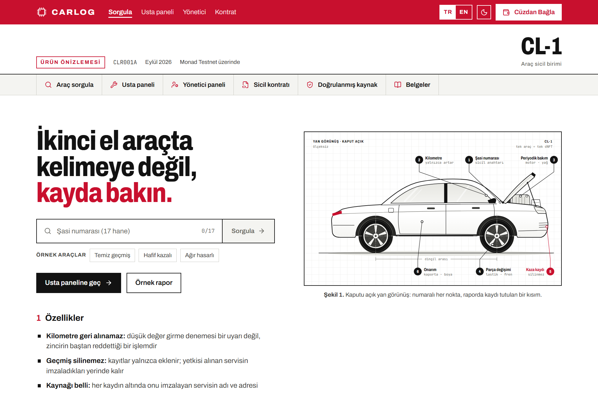
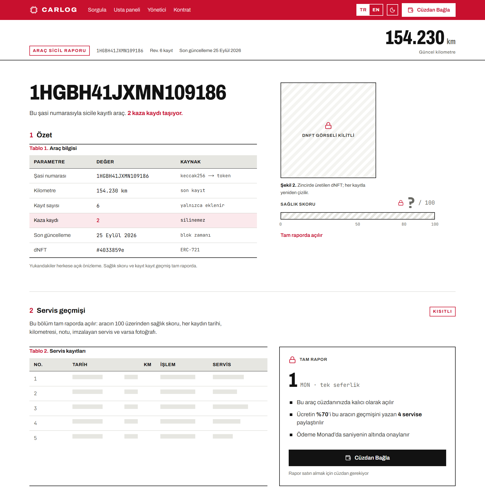
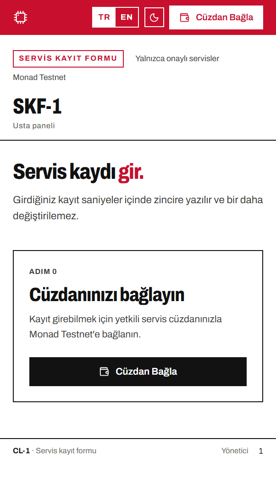
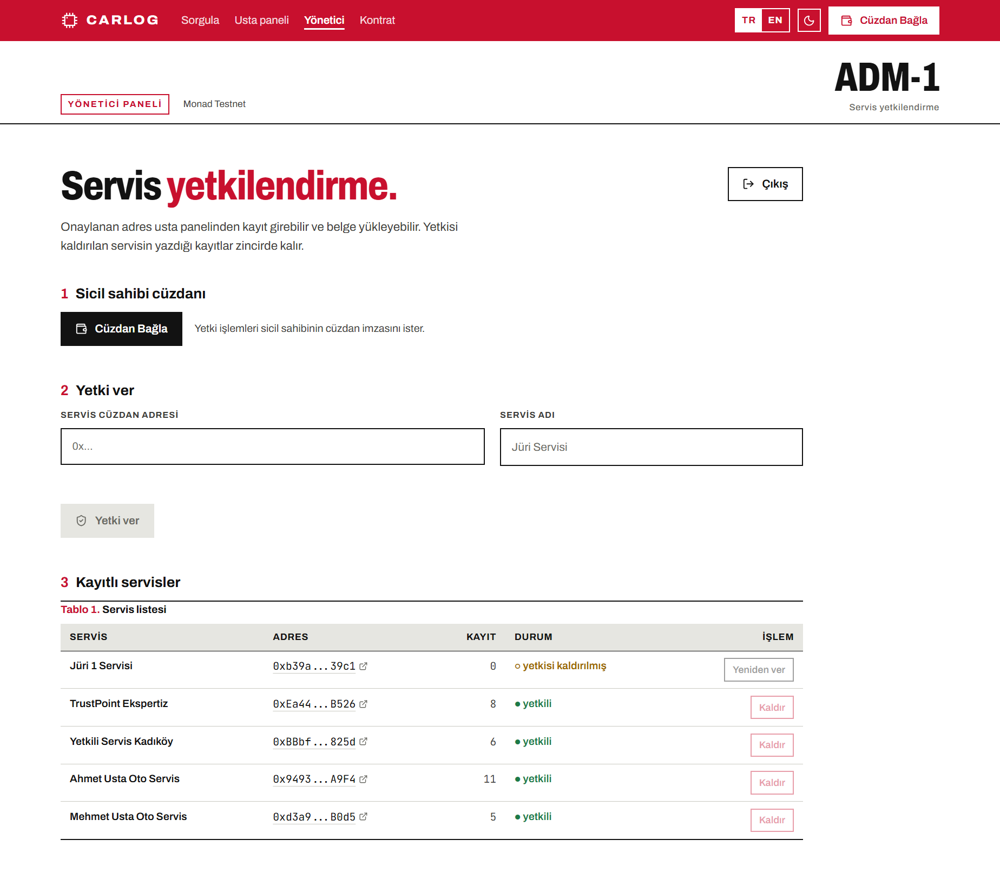
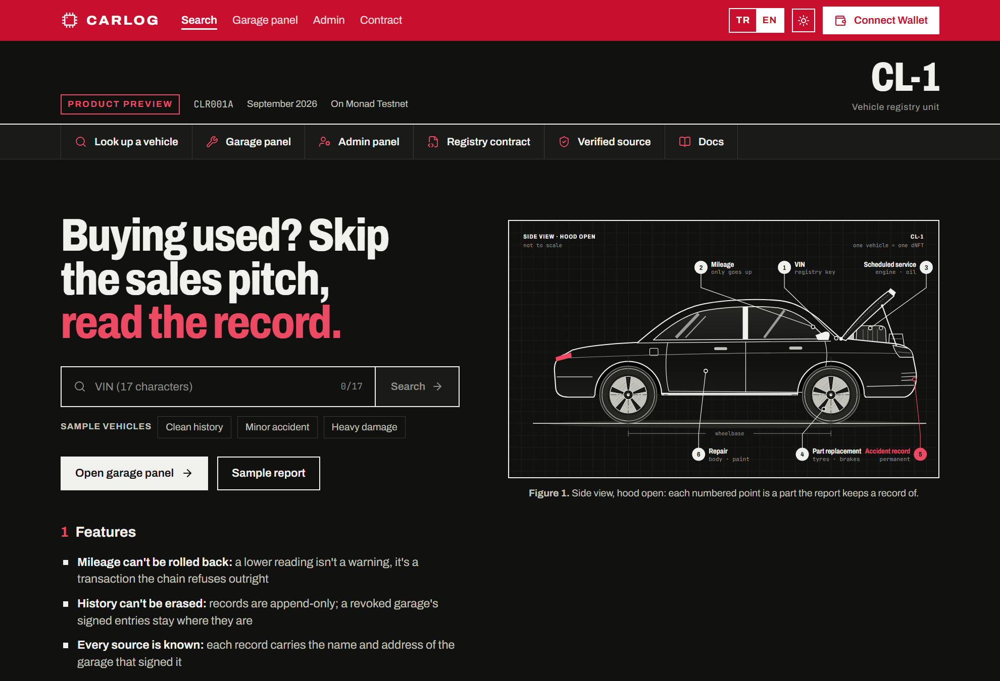

<div align="center">

# CarLog

**İkinci el araçta kelimeye değil, kayda bakın.**

Her aracın servis geçmişi Monad üzerinde bir dinamik NFT.
Kilometre geri alınamaz, kaza kaydı silinemez.
Raporu okuyan öder, geçmişi yazan usta kazanır.

[](https://testnet.monadexplorer.com/address/0x38a1a92d70a835674af97404c7635b43d0471dad)
[](https://testnet.monadexplorer.com/address/0x38a1a92d70a835674af97404c7635b43d0471dad)
[](https://sourcify.dev/server/repo-ui/10143/0x38a1a92d70a835674af97404c7635b43d0471dad)
[](#15-testler-ve-doğrulama)
[](#dil-ve-tema)
[](LICENSE)



</div>

---

## İçindekiler

1. [Problem](#1-problem)
2. [CarLog nedir](#2-carlog-nedir)
3. [Nasıl çalışır](#3-nasıl-çalışır)
4. [Ekranlar](#4-ekranlar)
5. [Hemen deneyin](#5-hemen-deneyin)
6. [Canlı kontrat](#6-canlı-kontrat)
7. [Neden Monad](#7-neden-monad)
8. [Mimari](#8-mimari)
9. [Akıllı kontrat](#9-akıllı-kontrat)
10. [Gelir modeli](#10-gelir-modeli)
11. [Güvenlik ve dayanıklılık](#11-güvenlik-ve-dayanıklılık)
12. [Teknoloji yığını](#12-teknoloji-yığını)
13. [Proje yapısı](#13-proje-yapısı)
14. [Kurulum ve çalıştırma](#14-kurulum-ve-çalıştırma)
15. [Testler ve doğrulama](#15-testler-ve-doğrulama)
16. [Güven varsayımları](#16-güven-varsayımları)
17. [Yol haritası](#17-yol-haritası)

---

## 1. Problem

İkinci el araç alırken elinizde iki şey var: satıcının anlattıkları ve gösterge
panelindeki rakam. **İkisi de değiştirilebilir.**

- Kilometre düşürmek bir kablo ve birkaç dakika meselesi.
- Kaza geçmişi, aracın servis dosyasıyla birlikte kaybolabiliyor.
- Ekspertiz raporu aracın o günkü halini anlatıyor, geçmişini değil.

Alıcı, hayatının en büyük alışverişlerinden birini doğrulayamadığı bir anlatıya
güvenerek yapıyor. Sorun veri eksikliği değil; her bakım bir serviste, her kaza
bir tutanakta kayıtlı. Sorun, bu kayıtların **dağınık, silinebilir ve sahibinin
kontrolünde** olması.

## 2. CarLog nedir

CarLog, araç servis geçmişini herkesin doğrulayabileceği ama kimsenin
değiştiremeyeceği bir sicile yazar. Her araç tek bir ERC-721 token'ı. Token
kimliği şasi numarasından türetildiği için camdaki numarayı bilen herkes aracı
sorgulayabilir.

Sistemde üç rol var:

| Rol | Ne yapar | Nereden |
|---|---|---|
| **Alıcı** | Şasi numarasıyla aracı sorgular; önizlemeyi ücretsiz görür, tam raporu 1 MON ödeyerek kalıcı olarak açar | Ana sayfa → `/vehicle/[şasi]` |
| **Usta / servis** | İşi bitirince telefondan kaydı girer: kilometre, işlem tipi, tarih, fotoğraf. Araç sicilde yoksa ilk kaydı açar. Rapor satıldıkça kazanır | `/report` |
| **Yönetici** | Hangi servislerin sicile yazabileceğine karar verir: yetki verir, kaldırır, geri verir | `/admin` |

**Ücretsiz önizleme:** aracın sicilde olduğu, güncel kilometresi, kaç kayıt ve kaç
kaza taşıdığı. Cüzdan gerekmez.

**Ücretli tam rapor:** 100 üzerinden sağlık skoru, zincirde üretilen NFT görseli,
kilometre grafiği ve her kaydın tarihi, notu, imzalayan servisi ve varsa
fotoğrafı. Bir kez ödenir, o araç o cüzdanda kalıcı olarak açılır.

## 3. Nasıl çalışır

```
 USTA                         ZİNCİR (Monad)                    ALICI
 ────                         ──────────────                    ─────
 Şasi no + km + işlem  ──►  1. Yetkili servis mi?          ◄──  Şasi numarasını yazar
 (+ fotoğraf → IPFS)        2. Km son değerden düşük mü?          │
                               └─ düşükse işlem REDDEDİLİR        ▼
                            3. Kayıt eklenir, skor güncellenir,  Önizleme (ücretsiz)
                               NFT görseli yeniden çizilir        │
                                                                  ▼
                            4. purchaseReport(1 MON)       ◄──  "Tam raporu aç"
                               ├─ %30 → platform cüzdanına       │
                               └─ %70 → kaydı yazan servislere    ▼
                                        (kayıt sayısına göre)    Tam rapor açılır
 "Çek" ile kazancını alır ◄─────────────┘
```

1. **Usta kaydı girer.** Şasi numarasını yazdığı anda panel zincirdeki son
   kilometreyi okur. Daha düşük bir değer yazarsa alan kırmızıya döner.
2. **Zincir doğrular.** Kontrat yetkisiz yazmayı, düşük kilometreyi ve gelecek
   tarihli işi reddeder. Geçerli kayıt yaklaşık 0,7 saniyede kesinleşir.
3. **Alıcı sorgular.** Önizleme sunucuda okunur, paylaşılabilir bir link olarak
   kalır.
4. **Alıcı öder, rapor açılır.** Ödeme tek işlemde bölüşülür; platform payı
   anında sahibin cüzdanına, servis payları kontrattaki bakiyelere gider.
5. **Usta kazancını çeker.** Usta panelindeki "Rapor geliriniz" kartından.

## 4. Ekranlar

### Alıcı: araç raporu

Bir ürün bilgi föyü (datasheet) gibi okunur: başlıkta güncel kilometre, altında
özet tablosu. Sağlık skoru ve NFT görseli kilitli; servis geçmişi ödeme kutusunun
arkasında.



Ödemeden sonra aynı alanda kilometrenin zaman içindeki grafiği (kazalar kırmızı)
ve numaralı kayıt tablosu açılır.

### Usta paneli

Mobil odaklı: tek kolon, büyük dokunma alanları, tek buton. Sicilde olmayan bir
şasi numarasında "ilk kaydı siz açıyorsunuz" moduna geçer ve aracı sicile kaydeder.

<div align="center">
  
</div>

Usta paneline telefondan **MetaMask uygulamasının kendi tarayıcısıyla** girilir.
Cüzdanı olmayan bir tarayıcıda "Cüzdan Bağla" bunu söyler ve sayfayı MetaMask
uygulamasında açan bağlantıyı verir.

### Yönetici paneli

Servis yetkilendirme ekranı. Üst menüdeki **Yönetici** bağlantısından, ana
sayfadaki **Yönetici paneli** düğmesinden ya da sayfa altından açılır.



### Dil ve tema

Üst banttaki **TR | EN** düğmesi bütün arayüzü İngilizceye çevirir; ay / güneş
düğmesi koyu temaya geçer. Seçimler tarayıcıda bir yıl saklanır ve sunucu sayfayı
ilk anda doğru dil ve renklerle çizer. Seçim yapılmamışsa tema sistem ayarını
izler.



## 5. Hemen deneyin

**Önizleme cüzdan istemiyor.** Ana sayfadaki örnek düğmelerine tıklayın ya da
şu şasi numaralarını yazın:

| Şasi numarası | Ne göreceksiniz |
|---|---|
| `WVWZZZ1JZXW000002` | Temiz geçmiş: tek ekspertiz kaydı, kaza yok |
| `NM0GE9F79E1234567` | Hafif kazalı: 7 kayıt, 1 kaza |
| `1HGBH41JXMN109186` | Ağır hasarlı: 6 kayıt, 2 kaza, şasi deformasyonu |
| başka bir 17 haneli numara | "Bu araç sicilde yok" ekranı |

Sayılar 26 Eylül 2026 itibarıyla; zincirdeki kayıtlar silinemediği için demo
sırasında eklenenlerle zamanla artar.

**Tam raporu açmak için** MetaMask'i Monad Testnet'e bağlayıp 1 MON ödeyin.
Test MON: [faucet.monad.xyz](https://faucet.monad.xyz) veya
[QuickNode faucet](https://faucet.quicknode.com/monad/testnet).

**Usta panelini denemek için** cüzdanınızın servis olarak onaylanması gerekir:

1. Proje sahibine MetaMask adresinizi verin.
2. Sahip `/admin` sayfasına girer (kullanıcı adı `admin`, şifre `0000`),
   kendi cüzdanını bağlar, adresinizi ve bir servis adı yazıp **Yetki ver**'e basar.
3. `/report` sayfasını yenileyin; kayıt formu açılır. Kayıt yazmak için
   cüzdanınızda biraz test MON olmalı.

## 6. Canlı kontrat

| | |
|---|---|
| **Ağ** | Monad Testnet (chainId `10143`) |
| **Sicil kontratı** | [`0x38a1a92d70a835674af97404c7635b43d0471dad`](https://testnet.monadexplorer.com/address/0x38a1a92d70a835674af97404c7635b43d0471dad) |
| **Doğrulanmış kaynak** | [Sourcify](https://sourcify.dev/server/repo-ui/10143/0x38a1a92d70a835674af97404c7635b43d0471dad): zincirdeki bytecode, bu depodaki kaynakla birebir aynı |
| **Rapor ücreti** | 1 MON (%30 platform / %70 servisler) |
| **RPC** | `https://testnet-rpc.monad.xyz` |
| **Explorer** | [testnet.monadexplorer.com](https://testnet.monadexplorer.com) |

> **İsim notu.** Proje geliştirme sırasında *MonadDrive* adını taşıyordu ve
> kontrat bu adla yayında (NFT adı "MonadDrive Vehicle", sembol `MDV`; zincirde
> üretilen görselde de bu yazı var). Kontratın Solidity kaynağına dokunmak,
> Sourcify doğrulamasını ve "zincirdeki kod = depodaki kod" garantisini bozacağı
> için eski isim zincirde bilerek bırakıldı. Arayüz ve belgelerin tamamı CarLog.

## 7. Neden Monad

Monad'ın saniyenin altındaki kesinleşme süresi burada süs değil, ürünün ön şartı.
Usta müşteriyi bekletirken bir blok onayı için 15 saniye beklemek zorunda olsaydı
bu sistem sanayide kullanılmazdı. Usta panelindeki sayaç bunu ölçüyor:

- Canlı zincirde ölçülen yazma süreleri (21 işlem): en hızlı **370 ms**, medyan **701 ms**.
- Sayaç butona basınca değil imza atıldıktan sonra başlıyor; ekrandaki rakam
  kullanıcının tereddüdünü değil ağın gecikmesini gösteriyor.

Ucuz işlem ücreti de aynı derecede önemli: her bakım kaydı ayrı bir işlem ve
ustanın bunu düşünmeden girebilmesi gerekiyor.

## 8. Mimari

```
┌──────────────────────┐ ┌──────────────────────────────────┐ ┌──────────────────┐
│ Usta paneli (mobil)  │ │ Alıcı paneli                     │ │ Yönetici paneli  │
│ /report              │ │ /vehicle/[vin]                   │ │ /admin           │
│ cüzdan gerekli       │ ├─────────────────┬────────────────┤ │ şifre + sahibin  │
│                      │ │ Önizleme        │ Tam rapor      │ │ cüzdan imzası    │
│                      │ │ sunucuda okunur │ ödeme sonrası  │ │                  │
│                      │ │ (10 sn önbellek)│ tarayıcıda     │ │                  │
└──┬──────────────┬────┘ └───────┬─────────┴───────┬────────┘ └────────┬─────────┘
   │ addRecordByVin│ imzalı       │ getVehicleSummary│ purchaseReport()   │ setServiceProvider()
   │ registerVehicle│ yükleme     │ reportSplit     │ getRecords()       │ getServiceProviders()
   │ withdrawEarnings│            │ (multicall3)    │ healthScore/tokenURI
   │               ▼              │                 │                    │
   │     ┌──────────────────┐     │                 │                    │
   │     │ /api/upload      │     │                 │                    │
   │     │ imza + zincirde  │     │                 │                    │
   │     │ servis kontrolü  │     │                 │                    │
   │     └────────┬─────────┘     │                 │                    │
   │              ▼               │                 │                    │
   │     ┌──────────────────┐     │                 │                    │
   │     │ IPFS (Pinata)    │     │                 │                    │
   │     └──────────────────┘     │                 │                    │
   ▼                              ▼                 ▼                    ▼
┌─────────────────────────────────────────────────────────────────────────────┐
│ VehicleRegistry.sol  (+ ServiceRegistry.sol)                                 │
│ ERC-721 · Record[] · sağlık skoru · servis yetkisi · rapor erişimi · bölüşüm │
│ tokenId = keccak256(şasi no) · tokenURI zincirde üretilen SVG                │
└─────────────────────────────────────────────────────────────────────────────┘
```

**Neden `tokenId = keccak256(şasi no)`:** Alıcı, zincir dışı hiçbir dizine ihtiyaç
duymadan camdaki numarayla aracı buluyor. Şasi numarasının kendisi zincire hiç
yazılmıyor, yalnızca özeti tutuluyor. Aynı araç iki kez kaydedilemiyor; ERC-721
zaten reddediyor.

**Neden indexer yok:** Kontratın view fonksiyonları bir sayfanın ihtiyacı olan her
şeyi veriyor. Monad testnet'te Multicall3 olduğu için özet, kayıtlar, NFT görseli
ve servis adları tek bir `eth_call` içinde geliyor.

## 9. Akıllı kontrat

Kaynak: [`contracts/contracts/`](contracts/contracts). Solidity 0.8.28,
OpenZeppelin ERC-721 ve Ownable, `viaIR` ile derleniyor.

### Ürünü taşıyan iki değişmez

**1. Kilometre geri alınamaz.**

```solidity
if (mileage < v.lastMileage) revert MileageRollback(v.lastMileage, mileage);
```

Düşük kilometre girme denemesi bir uyarı ya da sonradan fark edilecek bir
tutarsızlık değil, **hiç gerçekleşmeyen bir işlem.** Zincir onu baştan reddediyor.

**2. Hasar puanı azalmaz.** Kaza ve ağır hasar kalıcı hasar puanı ekliyor; düzenli
bakım puan kazandırıyor ama en fazla 10 puan telafi edebiliyor
(`MAX_CARE_BONUS = 10`). Kazalı bir araç, arka arkaya yağ değişimi girilerek temize
çıkarılamıyor.

| İşlem tipi | Hasar | Bakım puanı |
|---|---|---|
| Periyodik bakım | — | +2 |
| Muayene / ekspertiz | — | +1 |
| Parça değişimi | +2 | +1 |
| Onarım | +5 | — |
| Kaza kaydı | +15 | — |
| Ağır hasar | +30 | — |

Sağlık skoru = 100 + min(bakım, 10) − hasar; en fazla 100, en az 0. 80 ve üstü
temiz, 50–79 dikkat, 50 altı ağır hasar sayılıyor. Geçmiş yalnızca ekleniyor: bir servisin yetkisi
kaldırıldığında imzaladığı kayıtlar yerinde kalıyor.

### Kayıt yapısı

Her kayıt tek bir 32 baytlık storage slotuna sığıyor:

```
recordedAt(5) + serviceDay(2) + mileage(4) + recordType(1) + reporter(20) = 32 bayt
```

`recordedAt` zincirin kaydı kabul ettiği an, `serviceDay` işin yapıldığı gün. Usta
geçen haftaki işi bugün girebilir; o iş bugün yapılmış sayılmaz. Gelecek tarih
reddediliyor. Fotoğrafın IPFS CID'i ve not ayrı alanlarda.

### Başlıca fonksiyonlar

| Fonksiyon | Kim | Ne yapar |
|---|---|---|
| `registerVehicle(vin, km, gün, sahip, cid, not)` | Onaylı servis | Aracı sicile açar, ilk kaydı yazar, NFT'yi basar |
| `addRecordByVin(vin, km, gün, tip, cid, not)` | Onaylı servis | Kayıt ekler; düşük km ve gelecek tarih reddedilir |
| `purchaseReport(tokenId)` | Herkes (1 MON) | Raporu bu cüzdana kalıcı açar, ödemeyi bölüştürür |
| `withdrawEarnings()` | Servisler | Biriken rapor gelirini çeker |
| `setServiceProvider(adres, ad, aktif)` | Sahip | Servis yetkisi verir, kaldırır, geri verir |
| `setReportPrice` / `setPlatformShare` | Sahip | Fiyat ve platform payı |
| `getVehicleSummaryByVin`, `getRecords`, `getRecordsPaged` | Herkes | Okuma |
| `hasReportAccess(tokenId, cüzdan)` | Herkes | Rapor bu cüzdana açık mı |
| `reportSplit(tokenId)` | Herkes | Bir satışın kime ne kadar gideceği (ödemeden önce) |
| `healthScore`, `tokenURI` | Herkes | Skor ve zincirde üretilen NFT metadata'sı |
| `getServiceProviders`, `getServiceProvider` | Herkes | Servis listesi ve durumu |

Hatalar isimli: `MileageRollback`, `NotAuthorizedService`, `FutureServiceDate`,
`AlreadyPurchased`, `InsufficientPayment`, `NothingToWithdraw` ve diğerleri.

**Metadata zincirde üretiliyor.** `tokenURI` base64 JSON ve gömülü SVG döndürüyor;
görsel ve özellikler her yeni kayıtla değişiyor. "Dinamik NFT" burada mecaz değil;
sonradan değiştirilebilecek bir dosyaya işaret edilmiyor.

## 10. Gelir modeli

Alıcı bir aracın tam raporunu açtığında **1 MON** ödüyor. Ücret zincirde, tek
işlemde bölüşülüyor:

| Kime | Pay | Neye göre |
|---|---|---|
| Geçmişi yazan servisler | **%70** | O araçta kaç kayıt yazdıklarıyla orantılı |
| Platform | **%30** | Sabit |

Örnek: bir servis o araçtaki 5 kaydın 3'ünü yazdıysa servis payının 3/5'ini alır.
1 MON'luk satışta platforma 0,3 MON, servislere toplam 0,7 MON gider; bu servis
0,42 MON alır.

- **Platform payı satış anında doğrudan sahibin cüzdanına yatar;** ayrıca çekmek
  gerekmez.
- **Servis payları kontratta birikir** ve her servis kendi bakiyesini
  `withdrawEarnings` ile çeker. Bir araçta birden fazla servis olabilir; para
  alamayan tek bir adres bütün satışı düşürmemeli.
- Platform ödemesi en sona bırakılır; başarısız olursa satış yine tamamlanır ve
  pay çekilmeyi bekleyen bakiyeye düşer.

**Bu neden önemli:** "Usta neden oturup bunu telefona girsin?" sorusunun cevabı
bu. Yazdığı kayıt okundukça kazanıyor; sicil doldukça raporlar değerleniyor.

Rapor üç durumda ücretsiz: aracın NFT sahibi kendi aracını, onaylı servisler
üzerinde çalışacakları aracı, herkes de önizlemeyi görüyor.

## 11. Güvenlik ve dayanıklılık

| Konu | Nasıl çözüldü |
|---|---|
| **Kilitli rapor sızmasın** | Skor, NFT görseli ve kayıtlar sunucuda hiç yüklenmiyor; tarayıcı ancak zincir o cüzdanın erişimi olduğunu söyledikten sonra okuyor. Sayfa kaynağında yoklar (test edildi). |
| **Fotoğraf yükleme kötüye kullanılmasın** | `/api/upload` yalnızca onaylı servise açık. Usta cüzdanıyla ücretsiz bir mesaj imzalıyor; sunucu imzayı ve adresin zincirde onaylı servis olduğunu kontrol ediyor. Bir imza bir saat geçerli. Pinata anahtarı hiç tarayıcıya gitmiyor. |
| **Yönetici ekranı** | Kullanıcı adı / şifre sunucuda kontrol ediliyor, oturum sayfadaki kodun okuyamadığı (`HttpOnly`) bir çerezde 8 saat tutuluyor, sayfa arama motorlarına kapalı. Asıl kilit zincirde: yetki vermek `onlyOwner`, yani şifreyi bilen biri sahibin cüzdanı olmadan hiçbir şey değiştiremez. |
| **Kalabalık bir demo** | Monad'ın açık RPC'si saniyede 15 istek kabul ediyor. Sunucu her aracın önizlemesini 10 saniye saklıyor, aynı anda gelen aynı istekleri tek okumada birleştiriyor, RPC takılırsa son bilinen veriyi gösteriyor. 20 eşzamanlı ziyaretle test edildi (önceden 10 ziyarette çöküyordu). |
| **Ağa ulaşılamazsa** | Kendi hata sayfası ("Zincire şu an ulaşılamadı" + Tekrar dene), kendi 404 sayfası. Ana sayfa RPC olmadan da açılıyor. |
| **Cüzdan yoksa** | "Cüzdan Bağla" sessiz kalmıyor: bilgisayarda MetaMask kurulum bağlantısı, telefonda "MetaMask uygulamasında aç" bağlantısı veriyor. |
| **Gizli anahtarlar** | `contracts/.env` ve `web/.env.local` gitignore'da; depoya hiç girmedi. |

## 12. Teknoloji yığını

| Katman | Teknoloji |
|---|---|
| Zincir | Monad Testnet |
| Kontrat | Solidity 0.8.28, OpenZeppelin 5, Hardhat 3 + viem, `node:test` |
| Arayüz | Next.js 16 (App Router), React 19, Tailwind CSS 4, TypeScript |
| Cüzdan | wagmi 3 + viem, MetaMask (injected) |
| Depolama | IPFS (Pinata V3) |
| Tasarım | Archivo + JetBrains Mono; teknik bilgi föyü (datasheet) dili; TR/EN; açık/koyu tema |

## 13. Proje yapısı

```
.
├── contracts/                     Akıllı kontrat (Hardhat 3)
│   ├── contracts/                 VehicleRegistry.sol, ServiceRegistry.sol, IVehicleRegistry.sol
│   ├── test/                      38 test
│   ├── scripts/                   deploy, seed, approve, newcar, buy, status, keys, roles…
│   └── deployments/               Canlı adres ve ABI
├── web/                           Arayüz (Next.js)
│   ├── src/app/                   Sayfalar: /, /vehicle/[vin], /report, /admin, /api/upload,
│   │                              hata ve 404 sayfaları, ikon ve paylaşım görseli
│   ├── src/components/            Araba çizimi, rapor, usta formu, yönetici paneli, cüzdan…
│   └── src/lib/                   Zincir okumaları, önbellek, TR/EN sözlüğü, oturum, yükleme izni
├── docs/
│   ├── demo-senaryosu.md          90 saniyelik demo videosu senaryosu
│   └── screenshots/               README görselleri
└── LICENSE                        MIT
```

## 14. Kurulum ve çalıştırma

**Gereksinimler:** Node 20+, MetaMask ve test MON.

### 1. Kontratlar

```bash
git clone https://github.com/mehmetsayman/CarLog.git
cd CarLog/contracts
npm install
npm test                       # 38 test, zincire bağlanmadan çalışır

cp .env.example .env           # MONAD_PRIVATE_KEY satırını doldurun
npm run deploy                 # Monad Testnet'e yayınlar (fiyat varsayılanı 1 MON)
npm run seed                   # demo araçlarını ve servislerini geçmişleriyle yazar
```

### 2. Arayüz

```bash
cd ../web
npm install
npm run sync:contract          # kontrat adresini ve ABI'yi arayüze kopyalar
npm run dev                    # http://localhost:3000
```

Üretim derlemesi: `npm run build && npm start`.

### Ortam değişkenleri

**`contracts/.env`**

| Değişken | Zorunlu | Açıklama |
|---|---|---|
| `MONAD_PRIVATE_KEY` | Evet | Yayınlayan / sahip cüzdanın anahtarı. Atılabilir bir testnet cüzdanı kullanın |
| `REPORT_PRICE` | Hayır | Deploy'daki rapor ücreti (MON). Varsayılan `1` |
| `PLATFORM_SHARE_BPS` | Hayır | Platform payı, baz puan. Varsayılan `3000` (%30) |

**`web/.env.local`** (Vercel'de "Environment Variables")

| Değişken | Zorunlu | Açıklama |
|---|---|---|
| `PINATA_JWT` | Fotoğraf için | `org:files:write` yetkili Pinata anahtarı. Yoksa uygulama çalışır, yalnızca fotoğraf yüklenmez |
| `ADMIN_USERNAME` / `ADMIN_PASSWORD` | Hayır | Yönetici girişi. Varsayılan `admin` / `0000` |
| `MONAD_RPC_URL` | Hayır | Sunucunun okumaları için daha yüksek limitli özel RPC |
| `NEXT_PUBLIC_SITE_URL` | Hayır | Paylaşılan linklerdeki önizleme görseli için sitenin adresi; Vercel'de otomatik |

### Servis yetkilendirme

**Web'den (önerilen):** `/admin` → `admin` / `0000` → sahip cüzdanını bağla →
adres + ad → **Yetki ver**. Aynı ekrandan yetki kaldırılır ve geri verilir.

**Komut satırından** (`contracts/` içinde):

```bash
# macOS / Linux
GARAGE=0xADRES GARAGE_NAME="Servis adı" npm run approve
```

```powershell
# Windows PowerShell
$env:GARAGE = "0xADRES"; $env:GARAGE_NAME = "Servis adı"; npm run approve
# yetkiyi kaldırmak için ACTIVE=false ekleyin, sonra: Remove-Item Env:ACTIVE
```

### Demo ve bakım komutları

Hepsi `contracts/` içinde çalışır.

| Komut | Ne yapar |
|---|---|
| `npm run status` | Kasada ne var, kim ne kazandı, son satışlar |
| `npm run newcar` | Temiz yeni bir araç kaydeder ve şasi numarasını verir (`VIN=` ve `KM=` ile seçilebilir) |
| `npm run approve` | Bir adrese servis yetkisi verir veya kaldırır |
| `npm run buy` | Demo alıcı olarak bir rapor satın alır, bölüşümü yazdırır |
| `npm run keys` | Demo servis ve alıcı cüzdanlarını yazdırır (MetaMask'e aktarmak için) |
| `npm run roles` | Kendi usta ve müşteri adreslerinizi rollere bağlar, fonlar |
| `npm run usta-everywhere` | Demo servislerinden birine her araçta bir kayıt yazdırır (kazanç demosu için) |

> **Rapor erişimi araç başına kalıcıdır.** Bir cüzdan bir aracın raporunu bir kez
> açtıysa o araçta ödeme ekranı bir daha çıkmaz. Demo çekmeden önce
> `npm run newcar` ile taze bir araç açın.

### Vercel'e yayınlama

1. Depoyu Vercel'e bağlayın, **Root Directory** olarak `web` seçin.
2. Ortam değişkenlerine `PINATA_JWT` ekleyin (isteğe bağlı olarak
   `ADMIN_PASSWORD` ve `MONAD_RPC_URL`).
3. Deploy. Kontrat adresi `web/src/lib/contract/` içinde, ayrıca ayar gerekmez.

## 15. Testler ve doğrulama

```bash
npm --prefix contracts test    # 38 kontrat testi
cd web && npm run typecheck && npm run lint && npm run build
```

Kontrat testlerinin kapsadıkları:

- **Kilometre garantisi:** ileri kabul, eşit kabul, geri reddi, red sonrası verinin bozulmaması
- **Ödeme:** erişim kilidi, kalıcılık, çift ödeme reddi, eksik ödeme, fazla ödemenin
  iadesi, sahibe ve servise ücretsiz erişim, **bölüşümün kayıt sayısına göre
  ağırlıklandırılması**, platform payının doğrudan cüzdana gitmesi, çekim
- **Yetkilendirme:** yetkisiz yazma, yetkisi kaldırılan servis, geçmişinin korunması
- **Kayıt ve tarih:** çift kayıt reddi, kayıtsız araca yazma, geriye tarihli kayıt,
  gelecek tarih reddi
- **Skor ve okuma:** kaza düşüşü, bakım spam'ine karşı tavan, bilinmeyen şasi, sayfalama
- **Dinamik metadata:** yeni kayıtla değişmesi

Canlı sistem üzerinde ayrıca doğrulananlar:

- Zincirdeki bytecode, depodaki kaynakla birebir aynı.
- Sayfalar iki dilde de açılıyor, tarayıcı konsolunda hata yok.
- Kilitli veriler sayfa kaynağında yok.
- 20 eşzamanlı ziyarette 20/20 başarılı.
- Yükleme izni altı senaryoda doğru davranıyor: imzasız, onaysız cüzdan, süresi
  geçmiş imza, fazla uzun süre, başkasının imzası reddedildi; onaylı usta kabul
  edildi.
- Yönetici girişi gerçek tarayıcıda test edildi: yanlış şifre reddediliyor, sahte
  çerez işe yaramıyor.

## 16. Güven varsayımları

Zincir her şeyi çözmüyor. Sistemin sınırları:

- **Girdi doğruluğu.** Kontrat, yetkili bir servisin girdiği kilometrenin gerçek
  olduğunu doğrulayamaz. Garanti ettiği şey, girilen değerin bir daha
  düşürülemeyeceği ve kimin girdiğinin kayıtlı olduğu.
- **Yetkilendirme merkezi.** Servisleri şu an kontrat sahibi onaylıyor. Gerçek bir
  dağıtımda bunun yerine bir meslek odası çoklu imzası veya itibar temelli bir
  mekanizma gerekir.
- **Sicile girmemiş araç.** Kayıtlı olmayan bir şasi numarası "temiz geçmiş" değil,
  "henüz kimse girmemiş" demek. Arayüz bu ayrımı açıkça yapıyor.
- **IPFS kalıcılığı.** Pin düşerse CID zincirde kalır ama dosya erişilemez olabilir.
- **Ödeme duvarı gizlilik değil, üründür.** Kayıtlar herkese açık bir zincirde
  duruyor; kontrata doğrudan çağrı yapan biri onları okuyabilir. Satılan şey veri
  değil, **rapor**: derlenmiş, okunabilir, kaynağı belli bir sunum. Gerçekten
  şifrelemek, geçmişin herkesçe doğrulanabilir olmasını bozardı; bu takas bilinçli.

## 17. Yol haritası

- Servis itibar puanı: çok sayıda araçta tutarlı kayıt giren servisler öne çıksın
- Araç sahipliği devri (ERC-721 zaten destekliyor, arayüzü yok)
- Sigorta ve ekspertiz şirketleri için toplu sorgulama API'si
- Yetkilendirmenin çoklu imzaya taşınması
- Mobil cüzdanlar için WalletConnect

---

<div align="center">

**CarLog** · Monad Testnet · Solidity 0.8.28 · Hardhat 3 · Next.js 16 · wagmi + viem

[MIT Lisansı](LICENSE)

</div>
